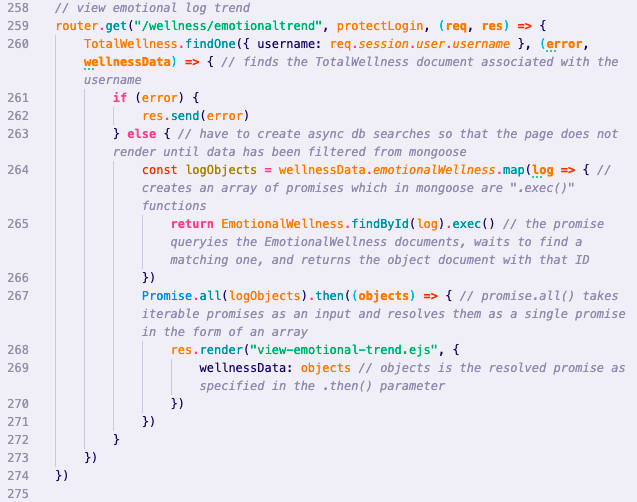

# [Wellness Tracker](https://protected-river-42213.herokuapp.com/login)

## Overview of Project 2  
Project 2 Goal: working full-stack application using Node.js, Mongoose, Express, and EJS that adheres to the MVC file structure.
 
***
 
Are you interested in becoming more aware of your self-care and wellness habbits? Look no further! The Wellness Tracker is here to support. 
  
I began with a mongoose model for a user that referenced four mongoose models corresponding with emotional, physical, nutritional, and social wellness. By taking user ratings of three categories within four wellness categories, a graph is populated with data from each category to display wellness trends. On the homepage, the user can click to scroll to the overview which highlights the categories with the highest and lowest averages as well as provides a wellness tip of the day. 
  
If you direct your attention to the top of the page you will see a button labeled "resources". Clicking this button will take you to an index of wellness resources. These resources, curated by the user, link to a page on which you can view the content, edit, and delete each resource.

 

***

### Technologies used  
This required a review of both asynchronous JavaScript and d3. Links to the articles I reviewed are commented out at relevant lines of code. Additionally, I implemented vanilla JavaScript, TypeScript, Lodash, JSON, HTML, CSS, Mongoose, Express, Node.js, Bootstrap, and Heroku.

 

### Notable Challenges  
I structured my data with referenced mongoose models. It was a challenge to learn how to pass data from my main model to referenced models. I found that I needed a promise structure. I first accessed the main mongoose model and then created a promise to map over the main model and find the referenced models matching a given ID. The promise was in the async structure of the .exec() method and it was resolved using Promise.all() as shown below. 

 

 

### Interesting Features  
On the homepage in the highlights section, a table displays the area of strength and area of growth. This is done by taking all of the data in each section, averaging it, and pulling out the maximum average and the minimum average. Then, it appends the title of each to the table and adds an href corresponding with the trend to the button below. In the future, I would like to change that process to use the slope of the graph's best fit line rather than the average.

 
***